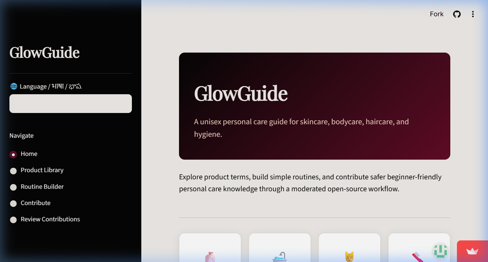
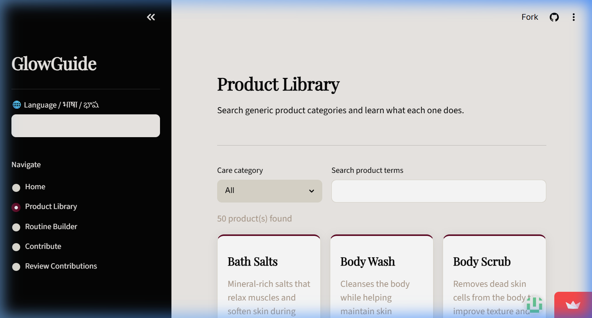
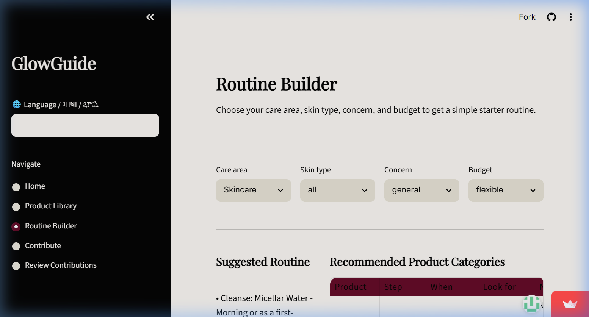

# GlowGuide

> A unisex, beginner-friendly personal care education platform — Skincare · Bodycare · Haircare · Hygiene.

[](https://glowguide-personalcare.streamlit.app/)
[](LICENSE)
[](https://www.python.org/)
[](https://github.com/astral-sh/ruff)
[](http://mypy-lang.org/)
[](https://github.com/SV1301/GlowGuide/actions)

---

## Table of Contents

1. [About](#about)
2. [Demo](#demo)
3. [Features](#features)
4. [Tech Stack](#tech-stack)
5. [Architecture](#architecture)
6. [Quick Start](#quick-start)
7. [Project Structure](#project-structure)
8. [Configuration](#configuration)
9. [Multilingual Support](#multilingual-support)
10. [Contributing](#contributing)
11. [Code Quality](#code-quality)
12. [License](#license)

---

## About

Many beginners feel overwhelmed by personal care content scattered across social media, blogs, and shopping apps. GlowGuide organises this information into one inclusive, beginner-friendly platform where users can:

- Understand what each generic product category does and when to use it.
- Build a simple starter routine tailored to their skin/scalp type, concern, and budget.
- Contribute knowledge through a moderated open-source workflow.

GlowGuide is **educational only** and does not diagnose or treat medical conditions.

---

## Demo

> **Live app →** [glowguide-personalcare.streamlit.app](https://glowguide-personalcare.streamlit.app/)

### Home — Care Category Navigator



### Product Library — Searchable & Filterable



### Routine Builder — Personalised Starter Routines



---

## Features

| Feature | Description |
|---|---|
| 📚 **Product Library** | 50+ generic product categories across Skincare, Bodycare, Haircare, and Hygiene |
| 🧴 **Routine Builder** | Filter by care area, skin/scalp type, concern, and budget to get a personalised starter routine |
| 💆 **Haircare Support** | Dedicated scalp-type selector and 15 haircare-specific concerns |
| 🌐 **Multilingual** | English, Hindi (हिन्दी), and Telugu (తెలుగు) — extensible to more languages |
| 📝 **Contributions** | Public submission form with pending/review/approve workflow |
| 🔒 **Moderation** | Passcode-protected reviewer screen; all submissions reviewed before going live |
| 🎨 **Premium UI** | Sensual colour palette, Playfair Display + Inter typography, animated cards |

---

## Tech Stack

| Layer | Technology |
|---|---|
| Framework | [Streamlit](https://streamlit.io/) |
| Language | Python 3.10+ |
| Database | SQLite (via Python `sqlite3`) |
| Internationalisation | JSON locale files + custom `modules/i18n.py` |
| Styling | Vanilla CSS injected via `st.markdown` |
| Deployment | [Streamlit Community Cloud](https://streamlit.io/cloud) |
| CI/CD | GitHub Actions · GitLab CI |
| Linting | Ruff · Flake8 · Pylint · Bandit · Mypy · Semgrep |

---

## Architecture

```
GlowGuide/
├── app.py                  # Streamlit entry point — pages, routing, UI
├── modules/
│   ├── database.py         # SQLite init, seed data (50 products), CRUD helpers
│   ├── recommendations.py  # Product filtering + routine summary logic
│   └── i18n.py             # Translation engine — t(), tl(), init_language()
├── locales/
│   ├── en.json             # English strings (source of truth)
│   ├── hi.json             # Hindi strings
│   └── te.json             # Telugu strings
├── .streamlit/
│   └── config.toml         # Streamlit theme (Sensual palette)
├── .github/workflows/
│   └── quality.yml         # GitHub Actions CI pipeline
├── .gitlab-ci.yml          # GitLab CI pipeline (mirrors GitHub)
├── cliff.toml              # git-cliff changelog config
├── pyproject.toml          # Ruff, Mypy, Pylint, Bandit, Vulture config
├── requirements.txt        # Runtime + dev dependencies
└── LICENSE                 # GNU AGPLv3
```

### Data flow

```
User selects care area / skin type / concern / budget
              │
              ▼
    modules/recommendations.py
      filter_products()          ◄── SQLite DB (glowguide.db)
      routine_summary()
              │
              ▼
    app.py renders results via st.table() + st.markdown()
```

---

## Quick Start

### Prerequisites

- Python 3.10 or higher
- Git

### Installation (Windows PowerShell)

```powershell
# 1. Clone the repository
git clone https://github.com/SV1301/GlowGuide.git
cd GlowGuide

# 2. Create and activate a virtual environment
python -m venv .venv
.\.venv\Scripts\Activate.ps1

# 3. Install dependencies
pip install -r requirements.txt

# 4. Run the app
streamlit run app.py
```

### Installation (Linux / macOS)

```bash
git clone https://github.com/SV1301/GlowGuide.git
cd GlowGuide
python -m venv .venv
source .venv/bin/activate
pip install -r requirements.txt
streamlit run app.py
```

The app opens at **http://localhost:8501**.

---

## Project Structure

```
modules/database.py     — SQLite helpers: initialize_database(), get_products(),
                          save_contribution(), review_contribution()
modules/recommendations.py — filter_products(), routine_summary()
modules/i18n.py         — SUPPORTED_LANGUAGES, t(), tl(), init_language(),
                          render_language_selector()
locales/en.json         — All user-facing strings (English baseline)
locales/hi.json         — Hindi translations
locales/te.json         — Telugu translations
```

> **Adding a new language:** Create `locales/<code>.json` mirroring `en.json`, then add one entry to `SUPPORTED_LANGUAGES` in `modules/i18n.py`.

---

## Configuration

| File | Purpose |
|---|---|
| `.streamlit/config.toml` | Streamlit theme — primary colour `#610C27`, background `#EFECE9` |
| `pyproject.toml` | Ruff, Mypy, Pylint, Bandit, Vulture settings |
| `.flake8` | Flake8 settings (max-line-length = 100) |
| `.semgrep.yml` | Local Semgrep security rules |
| `cliff.toml` | git-cliff changelog configuration |
| `.env.example` | Environment variable template |

---

## Multilingual Support

GlowGuide supports **English**, **Hindi**, and **Telugu** out of the box.

- Switch language from the sidebar selector at any time.
- The selected language is persisted via `?lang=<code>` URL parameter (shareable).
- All UI strings are externalised in `locales/*.json` — no hardcoded text in Python.
- Database filter values always use English internally so switching language never breaks recommendations.

---

## Contributing

Contributions are welcome! Please read [CONTRIBUTING.md](CONTRIBUTING.md) for the full guide including:

- Branch naming convention and PR process
- Coding standards and quality checks
- How to run tests
- How to report bugs and request features
- Content guidelines for educational submissions

You can also contribute knowledge directly through the **Contribute** page in the live app — no coding required.

### Development workflow

```powershell
# Run all quality checks locally
ruff check .
ruff format --check .
flake8 app.py modules/
mypy app.py modules/
bandit -r app.py modules/ -c pyproject.toml

# Run tests
pytest --cov=modules --cov-report=term-missing -q
```

### Commit convention

This project uses [Conventional Commits](https://www.conventionalcommits.org/):

```
feat: add mental wellness care category
fix: prevent empty routine builder results
docs: update multilingual setup guide
chore: bump ruff to 0.4.x
i18n: add Tamil locale file
```

Changelogs are generated automatically by [git-cliff](https://git-cliff.org/) on each release.

### Useful docs

| Document | Purpose |
|---|---|
| [CONTRIBUTING.md](CONTRIBUTING.md) | Full contributor guide |
| [docs/feedback.md](docs/feedback.md) | User feedback loop and prioritisation |
| [docs/growth-strategy.md](docs/growth-strategy.md) | Growth strategy (user base) |
| [docs/geographical-expansion.md](docs/geographical-expansion.md) | Geographical expansion plan |
| [PRIVACY.md](PRIVACY.md) | Privacy policy |
| [SECURITY.md](SECURITY.md) | Security and vulnerability disclosure |

---

## Code Quality

The CI pipeline (GitHub Actions + GitLab CI) runs on every push to `main`:

| Tool | Purpose |
|---|---|
| **Ruff – lint** | Fast Python linter (replaces Flake8 for most rules) |
| **Ruff – format** | Enforces consistent formatting |
| **Flake8** | Additional style checks |
| **Pylint** | Deep static analysis (threshold: 7.0/10) |
| **Mypy** | Static type checking |
| **Bandit** | Security vulnerability scanning |
| **Semgrep** | Custom security rules (local config) |
| **Vulture** | Dead code detection |
| **Pyupgrade** | Enforces modern Python syntax |
| **Gitleaks** | Secret / credential leak detection |
| **Coverage** | Test coverage reporting (pytest-cov) |
| **git-cliff** | Automated changelog from conventional commits |

---

## Security & Privacy

Please read [SECURITY.md](SECURITY.md) for our vulnerability disclosure policy.  
Please read [PRIVACY.md](PRIVACY.md) for how user data and contributions are handled.  
Do not open public issues for security vulnerabilities.

---

## License

GlowGuide is released under the **GNU Affero General Public License v3.0 (AGPLv3)**.  
See [LICENSE](LICENSE) for the full text.

```
Copyright (C) 2025 GlowGuide Contributors

This program is free software: you can redistribute it and/or modify
it under the terms of the GNU Affero General Public License as published
by the Free Software Foundation, either version 3 of the License, or
(at your option) any later version.
```
